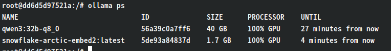
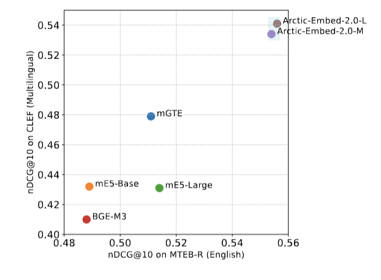
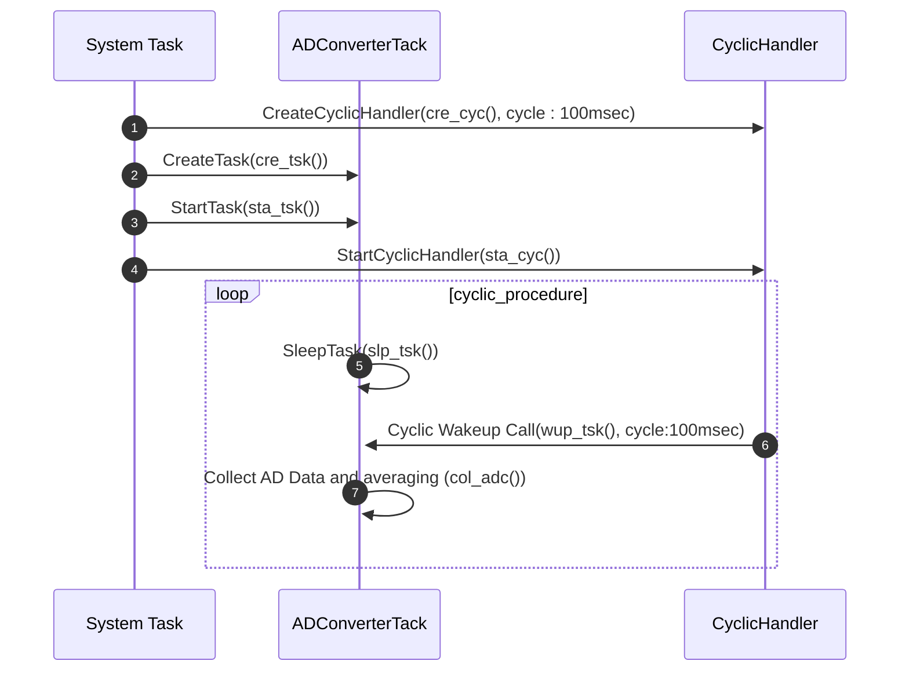

# RAG

## まとめ

- 人はLLMのための従順な奴隷として文書を**丁寧に整形して**渡すことに専念すべき
- **あらゆる文書はマークダウン記法**で記述すべき
- パワポの図は使わず, フローチャートやシーケンスダイアグラムは**マーメイド記法**に統一すべき
  [マーメイド記法](#mermaid)
---

# 開発環境



## 埋め込みベクター処理用のモデル

Snowflake Arctic Embed 2

パラメーター数 : 568m

説明: VRAM 1GB程度で動かせる軽量なもの
Arctic Embed 2.0は、これまでのリリースで培った堅牢な基盤をベースに、英語のパフォーマンスや拡張性を損なうことなく多言語サポートを追加し、幅広い言語とアプリケーションにまたがる、より幅広いユーザーベースのニーズに対応します。




## 推論(inference)用のモデル

Alibaba Qwen3-32B-Q8_0.gguf

パラメーター数: 32B

説明: ローカルLLMとしては最高クラス。VRAM 30GB-40GB程度で動かせるもの。

## セットアップ

エディター: VSCode

拡張機能  : Continue

LLM runner : Ollama (Docker container)

LLM models : 上記の通り

---

# 推論結果(Qwen3-32Bを用いてRAGありの会話を行った結果)


# 質問1

```
NORTiの割り込みハンドラーサービスルーチンについて全て詳細に説明してください
@NORTi
```
# 回答


NORTiでは、割込み管理機能を担う2種類のコンセプトが存在します：「割込みハンドラ (Interrupt Handler)」と「割込みサービスルーチン (Interrupt Service Routine, ISR)」。これらはμITRON仕様に基づいており、カーネルの処理とユーザの独自処理の役割分担を担っています。

---

## 割込みハンドラ

### 概要
NORTiでは、**割込みハンドラは直接C言語で記述**することが可能で、スタック管理を除くレジスタの待避/復元を行う独自の`ent_int()`・`ret_int()`システムコールが提供されています。カーネルは割込みハンドラに直接介入せず、制御がユーザのコードに直接渡ります。

### 仕様と実装
- **割込みハンドラの定義と登録**  
  システムコール`def_inh()`を使用します。これはカーネルが割込みベクタを管理する方法として動作します。
  
  ```c
  def_inh(IRQ_NO, inthdr);
  ```
  ここでは、対応する割込み番号`IRQ_NO`に割込みハンドラ`inthdr`を設定しています。

- **割込みハンドラのテンプレート**  
  ```c
  INTHDR inthdr(void) {
      ent_int(); // スタックの切替えとレジスタ待避
      /* 割込み処理 */
      ret_int(); // レジスタ復元とタスク復帰
  }
  ```
  - `ent_int()`と`ret_int()`が必須です。これらはレジスタの保存と復元、スタック切り替えをNORTi内部で実施します。
  - `INTHDR`はNORTi独自の型であり、**割込みハンドラ関数としての属性を設定**します。

### 制限と制約
- **カーネルレベル以下の割込みレベル**でないと暴走の原因となる可能性があります。
- カーネルの割込み禁止レベル(`#define KNL_LEVEL 6`)よりも高い優先度の割込み処理は、カーネルの処理が上書きされるリスクがあるため避ける必要があります。

---

## 割込みサービスルーチン (ISR)

### 概要
割込みサービスルーチンは、μITRON4.0で導入されたより柔軟な割込み処理メカニズムです。これは、カーネル内に存在する割込みハンドラ（ent_int含む）によって呼ばれ、レジスタの保存/復元処理を内部で行います。そのため、ユーザはC言語の通常関数として利用できます。

### 仕様と実装
- **割込みサービスルーチンの定義**  
  システムコール`cre_isr()`を使用します。
  ```c
  cre_isr(IRQ_NO, isr_routine, exinf, istatr);
  ```
  - `istatr`には、例として`TA_HLNG`（高級言語）を指定します。
  - `exinf`は割込みサービスルーチンを呼び出す際に使用する引数です。

- **割込みサービスルーチンの実行**  
  割込みサービスルーチンは、`cre_isr()`で登録されると、後で割込みが発生した際、カーネル内のハンドラによって自動的に実行されます。

  例:
  ```c
  void isr_routine(INT inf) {
      // 割込み処理（タイマーや外部割込みの応答など）
      // auto変数が使えるため、一般的なC関数として扱える。
  }
  ```

### 特徴と制約
- **レジスタ待避/復元処理はNORTi内部で完了**されるため、C言語の通常関数で実装可能。
- **タスクとの同期や通信を行うことはできない**。これは、割込みコンテキストで実行されるため、スレッド安全でないAPI（タスク起動、イベント通知など）は利用できません。
- **カーネルレベルより高い優先度の割込みでは、サービスルーチンの利用は不可能**です。

---

## 比較表: 割込みハンドラ vs 割込みサービスルーチン

| 項目                     | 割込みハンドラ                      | 割込みサービスルーチン                |
|------------------------|-------------------------------------|-------------------------------------|
| 実装言語               | C言語、`INTHDR`型を指定              | 普通のC関数（auto変数が使用可能）     |
| システムコール         | `def_inh()`                        | `cre_isr()`                        |
| レジスタ管理           | ユーザが`ent_int()`・`ret_int()`を使用 | NORTiが自動でレジスタ管理           |
| スタック管理           | NORTiが専用スタックを使用               | タスクスタックを使用（通常）           |
| タスク同期可否         | 不可能                              | 不可能（割込みコンテキストなので）     |
| 割込みレベル           | カーネル以下が必要                   | 同様（カーネルレベル以下）            |

---

## システムコールと関連処理

### ent_int / ret_int
```c
INTHDR inthdr(void) {
    ent_int(); // → スタック切り替えとレジスタの一部保存
    isig_tim(); // （例）割込みをOSに通知
    ret_int(); // → レジスタ復元、タスク復帰
}
```

- `ent_int()`は、**スタックポインタを割込み専用スタックへ移動**し、レジスタの保存を行う。
- `ret_int()`は、**割込みからの復帰を処理**し、適切なタスクまたは次の割込みハンドラへ制御を戻す。

### カーネルの割込み禁止レベル
カーネル内の処理には一時的な割込み禁止が必要であるため、割込みサービスルーチンとハンドラが動作可能な割込みレベルは、カーネルによって制御されています。

---

## 注意点と推奨
- **複数の割込みハンドラ/サービスルーチンが同じ割込み番号を定義することはできない。**
- ハードウェアやプロセッサ依存の処理（割込みベクタの設定、ステータスレジスタの直接操作）については、`n4ixxx.c`に記述された関数を利用または独自に実装する必要があります。
- 高速かつ短い割込み処理が求められます。特に**割込みハンドラ内でCPUを長く占有するのは避けるべきです。**

---

## おわりに
NORTiの割込み管理は、μITRON4.0の仕様を基盤に、柔軟性のある2層構造（ハンドラとサービスルーチン）によって構成されています。割込みハンドラはレジスタ管理を自分で行いますが、サービスルーチンはNORTiがそれを完全に自動化しているため、C言語での通常関数として扱うことができます。両者に合わせて使い分けることで、リアルタイムな割込み処理を効率よく構築できます。


# 質問2

 
```
nortiで定数として規定されているものを全て表にまとめて下さい。
定数の名前，値，説明
という参考を表に必ず含めてください
@NORTi
```

## 回答

以下にNORTiで定義されている**定数**の情報を表にまとめます。提供されたドキュメントに基づく情報のみを記載します。

---

### **NORTiで定義される定数一覧**

| 定数名       | 値   | 説明                                 |
|--------------|------|--------------------------------------|
| `TRUE`       | `1`  | 真（ブール値）                       |
| `FALSE`      | `0`  | 偽（ブール値）                       |
| `KNL_LEVEL`  | `6`  | カーネルの割込み禁止レベル（例として`6`） |

---

### **説明と補足**
1. **`TRUE`と`FALSE`**  
   - **用途**：ブール型の真偽判定に使用。  
   - **定義場所**：ドキュメントの「その他の定数」セクションで明示されています。  
   - **例**：条件分岐やフロート処理で使用。`if (flg == TRUE) { ... }`

2. **`KNL_LEVEL`**  
   - **用途**：カーネル内部の割込み禁止レベルを定義。  
   - **定義場所**：カーネルの割込みレベルを制御するために`#define`されたマクロ（例：`#define KNL_LEVEL 6`）。  
   - **注意点**：この値によって、カーネルが管理する割込みハンドラ/サービスルーチンの優先度が決まります。カーネルより高優先度の割込みでは暴走の原因となるため、**カーネル以下**の割込みレベルに設定する必要があります。  
   - **例**：
     ```c
     #define KNL_LEVEL 6  // カーネルの割込み禁止レベル
     #include "nocfg4.h"   // コンフィグレーション定数を含む
     ```

---

### **その他の定数（コンフィグレーション定数）**
- **`nocfg4.h`に定義**される以下の定数もありますが、その**具体的な名前や値は提供されたドキュメントに記載されていません**。詳細な定数は以下のファイルに含まれています：
  - `kernel.h`（カーネル全体の定義含む）
  - `nocfg4.h`（カーネルコンフィグレーション定数）
  - `n4ixxx.c`（プロセッサ依存の定数・関数）
- **補足**：`nocfg4.h`には最大タスク数、メモリプール数、割込みハンドラ数などの**コンフィグレーションパラメータ**が含まれていますが、具体的な値はプロジェクト設定やユーザーのカスタマイズに依存します。

---

### **参考資料**
- 提供されたドキュメント内「その他の定数」セクション
- `kernel.h`、`nocfg4.h`、`n4ixxx.c`（NORTiインストールディレクトリの`/NORTi/INC`と`/NORTi/SRC`配下に存在）  
- NORTiコンフィグレータのマニュアル（より詳細なコンフィグレーション定数の解説）

---

### **補足アドバイス**
- **カスタムコンフィグレーション**は、`nocfg4.h`を直接編集するか、NORTiコンフィグレータを使用することを推奨されます。  
- `TRUE`と`FALSE`は、C標準ライブラリや他のOSとの互換性を考慮する際の代替として使用される場合もありますが、NORTiでは独自の定義がされているため、その用途は明示されています。

# 質問3

```
NORTiのエラーコード一覧を表示してください
@NORTi
```

## 回答


以下は、提供されたドキュメントから抽出した**NORTiのエラーコード一覧**です。値は16進数・10進数の両方を表記し、説明は日本語で記載しています。

---

### **NORTi エラーコード一覧**

| エラーコード名       | 値 (16進 / 10進) | 説明                             |
|----------------------|------------------|----------------------------------|
| `E_OK`               | `0` / `0`        | 正常終了                         |
| `E_SYS`             | `0xFFFb` / `-5`  | システムエラー                   |
| `E_NOSPT`           | `0xFFF7` / `-9`  | 未サポート機能                   |
| `E_RSFN`            | `0xFFF6` / `-10` | 予約機能コード                   |
| `E_RSATR`           | `0xFFF5` / `-11` | 予約属性                         |
| `E_PAR`             | `0xFFef` / `-17` | パラメータエラー                 |
| `E_ID`              | `0xFFee` / `-18` | 不正ID番号                       |
| `E_CTX`             | `0xFFe7` / `-25` | コンテキストエラー               |
| `E_ILUSE`           | `0xFFe4` / `-28` | システムコール不正使用           |
| `E_NOMEM`           | `0xFFdf` / `-33` | メモリ不足                       |
| `E_NOID`            | `0xFFde` / `-34` | ID番号不足                       |
| `E_OBJ`             | `0xFFd7` / `-41` | オブジェクト状態エラー           |
| `E_NOEXS`           | `0xFFd6` / `-42` | オブジェクト未生成               |
| `E_QOVR`            | `0xFFd5` / `-43` | キューイングオーバーフロー       |
| `E_TMOUT`           | `0xFFce` / `-50` | ポーリング失敗またはタイムアウト |
| `E_RLWAI`           | `0xFFcf` / `-49` | 待ち状態の強制解除               |
| `E_DLT`             | `0xFFcd` / `-51` | 待ちオブジェクトの削除           |

---

### **補足説明**
1. **`E_ID` に関する注意点**  
   - NORTiカーネル **4.05.00以前のバージョンでは、`E_ID`が誤って`E_PAR`として実装**されている場合があります。  
   - 関連するシステムコール例：`ref_alm`（アラームハンドラ参照コール）。

2. **エラーコードの分類**  
   - **静的エラー**：パラメータの範囲外など、デバッグ後に解消できるエラー。例：`E_ID`, `E_PAR`。
   - **動的エラー**：システム状態やタイミングに依存するエラー。例：`E_TMOUT`, `E_QOVR`。  
   - NORTiでは高速化のために、静的エラーのチェックを省略したライブラリも提供されています。

3. **参照元のセクション**  
   このエラーコード一覧は、提供されたドキュメントの **7.1 エラーコード一覧**セクションに記載されています。

---

### **関連するシステムコールとの対応例**
一部のシステムコール（例：`ref_alm`）では、エラーコードがバージョンによって異なる可能性があるため、開発時のNORTiバージョンに注意する必要があります。詳細なエラーハンドリングについては、各システムコールの仕様解説を参照してください（例：`ref_alm`や`stp_alm`）。

---

### **参考資料**
- NORTi公式ドキュメントの **7.1 エラーコード一覧**  
- 各システムコールのエラーハンドリング記述（例：`stp_alm`や`ref_alm`の戻値セクション）。  
- `kernel.h`や`norti3.h`のインクルードファイル内のエラーコード定義。

# 質問4

```
NORTiのシステムコールをすべてマークダウン形式の一覧表にして出力してください
@NORTi
```

## 回答

以下は、提供されたドキュメントから抽出した **NORTiのシステムコール一覧**です。システムコールはカテゴリ別に分類し、説明や注意点を記載しています。

---

### **NORTi システムコール一覧**

| カテゴリ                   | システムコール | 機能 | 補足説明 | 例 |
|--------------------------|----------------|------|----------|----|
| **時間管理 / アラームハンドラ** | `cre_alm()`    | アラームハンドラの生成 | IDを指定して生成する。 | `cre_alm(almid, pk_calm);` |
| **時間管理 / アラームハンドラ** | `acre_alm()`   | アラームハンドラの生成（ID 自動割付） | IDを自動で割り当てる。 | `acre_alm(pk_calm);` |
| **時間管理 / アラームハンドラ** | `del_alm()`    | アラームハンドラの削除 | アラームハンドラを削除する。 | `del_alm(almid);` |
| **時間管理 / アラームハンドラ** | `sta_alm()`    | アラームハンドラの開始 | 指定したIDのハンドラを開始。 | `sta_alm(almid, almtim);` |
| **時間管理 / アラームハンドラ** | `stp_alm()`    | アラームハンドラの停止 | 指定したIDのハンドラを停止。 | `ER stp_alm(ID almid);` |
| **時間管理 / アラームハンドラ** | `ref_alm()`    | アラームハンドラの状態参照 | 現在の状態を参照。 | `ref_alm(almid, pk_ralm);` |

| **サービスコール管理** | `def_svc()`    | 拡張サービスコール定義 | サービスコールの定義に使用。 | `def_svc(fncd, pk_dsvc);` |
| **サービスコール管理** | `cal_svc()`    | サービスコール呼出し | 定義済みのサービスコールを実行。 | `cal_svc(fncd, par1, par2, ...);` |

| **割込み管理** | `ent_int()`    | 割込みハンドラ開始 | 割込みハンドラの入口で呼ばれる。レジスタ退避やスタック切り替えを行う。 | ```INTHDR inthdr(void) { ent_int(); func(); ret_int(); }``` |
| **割込み管理** | `vdis_psw()`   | 割込み禁止 | `vset_psw`と組み合わせて一時的に割込みを禁止する。 | カーネルより高優先の割込みルーチンでも使用可能。 |
| **割込み管理** | `vset_psw()`   | ステータスレジスタ操作 | 割込みマスクだけでなく全ビット操作可能。 | NORTi独自のシステムコール。 |

| **タスク管理** | `vget_tid()`   | 自タスクのID取得 | 現在タスクのIDを取得する。 | `ID vget_tid(void);` |
| **タスク管理** | `vcan_wup()`   | 起床要求クリア | キューイングされた起床要求をクリアする。 | `vcan_wup();` |

| **同期管理** | `isig_tim()`   | チックタイム通知 | 周期タイマーより通知を受け取る。 | ```INTHDR inthdr(void) { ent_int(); isig_tim(); ret_int(); }``` |

| **アラームハンドラ関連** | `ref_alm()`    | アラームハンドラ参照 | ハンドラ状態を参照する際の戻り値に`E_ID`, `E_NOEXS`を含む。 | ```ER ref_alm(ID almid, pk_ralm);``` |
| **アラームハンドラ関連** | `stp_alm()`    | 停止 | 戻り値が`E_OK`（正常）、`E_ID`、`E_NOEXS`（NORTi 4.05.00以前は`E_PAR`）。 | ```ER stp_alm(ID almid);``` |

| **NORTi3互換モード** | ヘッダファイル交換 | NORTi3互換 | `kernel.h` → `norti3.h` | μITRON3.0と4.0のシステムコール混在が可能。 |

---

### **注目すべき特徴 / 注意点**
1. **NORTi独自のシステムコール**：
   - `vset_psw`, `vdis_psw`, `vget_tid`, `vcan_wup`はNORTiオリジナルの機能。
   - 割込み処理やステータス操作において高速化が図られる。

2. **アラームハンドラの停止 (`stp_alm`) の戻値注意点**：
   - NORTiカーネル 4.05.00以前では`E_ID`が`E_PAR`として誤実装されていた。

3. **サービスコール管理（`def_svc`, `cal_svc`）**：
   - 拡張可能で柔軟なコールバック実装に使用。

---

### **未サポート機能**
- `def_exc`（CPU例外ハンドラ定義）は未サポート。

---

### **参考**
- 提供されたドキュメントの **7.2 システムコール一覧**, **5.11 割込み管理機能**, **5.16 システム状態管理機能**。

# 質問5

```
@NORTi で割り込みハンドラーが正常に動作しません。
不具合の調査を行いたいのでサンプルコードを作成してください。
タスクを複数作成し，さらにCPUのシリアル入力のIRQに割当て，そのシリアル入力の割り込みが入るという想定でコードを作成してください
```

## 回答


以下は、NORTiでの割込みハンドラーの不具合調査用のサンプルコードです。複数タスクの作成とシリアル入力のIRQ割込み処理を含みます。`def_inh()`などのハードウェア依存部はコメントで指示します。

```c
#include "kernel.h"  // NORTi カーネルヘッダ

#define TSKID_MAX 2   // 最大タスクID
#define TSTKSZ 256    // タスクスタックサイズ
#define ISTKSZ 256    // 割込みハンドラスタックサイズ

// グローバル変数（デバッグ用）
volatile unsigned int serial_irq_count = 0;

// タスク1：メインロジック（定期実行）
void task1(void)
{
    while (1) {
        // 割込み発生を待機（10msスリープ）
        dly_tsk(10);  
        
        // 割込みカウンタ表示
        if (serial_irq_count > 0) {
            serial_irq_count--;  // デバッグ用減少
            // (ここにシリアル出力処理を記述)
        }
    }
}

// タスク2：シリアル送受信処理（簡略化）
void task2(void)
{
    while (1) {
        dly_tsk(50);  // シリアルポートスキャン
        // シリアルデータ送信ロジック
    }
}

// シリアル入力IRQハンドラ（例：UART Rx IRQ）
INTHDR serial_irq_handler(void)
{
    ent_int();  // 割込み処理エントリ（必須！）

    // 1. ハードウェア依存コード
    //    ↓↓↓ 下記は例です。適切なハードウェア依存処理が必要
    //      （例：レシーバレジスタ読み取り、割込みフラグクリア等）
    // Read_UART_REGISTER();
    // Clear_IRQ_Flag();
    // ↑↑↑ ここにシリアル入力の割込み処理を実装

    serial_irq_count++;  // デバッグ用カウンタ
    
    ret_int();  // 割込み処理終了（必須！）
}

int main(void)
{
    ID tskid1, tskid2;

    // 初期化
    sysini();  // カーネル初期化

    // タスク作成
    tskid1 = cre_tsk(TSKID1,  // タスクID
                     TPRIO1,  // 優先度
                     task1,
                     TSTKSZ,
                     NULL,
                     TA_HLNG | TA_NULL);

    tskid2 = cre_tsk(TSKID2,
                     TPRIO2,
                     task2,
                     TSTKSZ,
                     NULL,
                     TA_HLNG | TA_NULL);

    // タスク起動
    sta_tsk(tskid1);
    sta_tsk(tskid2);

    // 2. シリアル割込みハンドラの設定（例）
    //    ↓↓↓ 以下は架空の設定例です
    //    実際には def_inh() や cre_isr() を使用
    // def_inh(SERIAL_IRQ_VECTOR, serial_irq_handler, ...);
    
    // システム起動
    syssta();  // マルチタスク開始（main()はここで終了）

    // エラー処理（ステータスチェック）
    while (1) {
        dly_tsk(1000);  // デバッグ用無限ループ
    }
}
```

---

### 重要なポイントと対応策
1. **割込みハンドラの構造**  
   - `ent_int()` と `ret_int()` のペアが必須  
     ❌エラー例:  
     ```c
     void bad_handler(void) {
         // ent_int() なし
         // ...処理...
     }
     ```
     ✅正しい例:
     ```c
     INTHDR my_irq_handler(void) {
         ent_int(); 
         // ...処理...
         ret_int();
     }
     ```

2. **ハードウェア依存処理**  
   - 以下の箇所をプロセッサドライバに置き換える必要があります
     ```c
     // Read_UART_REGISTER();  // レシーバレジスタ読み取り
     // Clear_IRQ_Flag();      // 割込みフラグクリア
     ```
   - 割込みベクタ設定は `n4ixxx.c` または独自実装が必要
     ```c
     // def_inh(SERIAL_IRQ_VECTOR, serial_irq_handler, ...);  // サンプル
     ```

3. **レジスタ保護とスタック**  
   - `ent_int()` は自動的に：
     - レジスタのスタック保存
     - 割込み専用スタックへの切り替え
   - **注意**: 最適化設定が `ent_int()` に干渉しないか確認
     ```bash
     # コンパイル例（最適化必須）
     gcc -O2 -c serial_irq_handler.c
     ```

4. **デバッグ方法**  
   - ログをシリアルポートに送信する簡易デバッガーを作成
     ```c
     void log_debug(const char* msg) {
         // シリアル送信ロジック
     }
     ```
   - `serial_irq_count` をモニタリングして割込みの発生を確認

5. **割込みマスクの確認**  
   - カーネルより優先度の高い割込みを処理する場合
     ```c
     vset_psw(...);  // ステータスレジスタ直接操作（NORTi独自）
     ```

---

### 次のステップ
1. **ハンドラ内のレジスタダンプ**  
   ```c
   void dump_regs() {
       // 各プロセッサのレジスタダンプメカニズムを実装
   }
   ```
   - 割込み発生時にレジスタの状態をログに出力

2. **タスクのスケジューリング確認**  
   - 割込み後タスクが適切に切り替わるか確認
     ```c
     void check_current_task() {
         ID current = vget_tid();
         // 現在実行中のタスクIDをログ出力
     }
     ```

3. **実行メモリサイズ確認**  
   - システムマネジメントを確認
     ```c
     void check_heap() {
         // ヒープ使用状況のチェック
     }
     ```

# 質問6 {#mermaid}




## 回答

NORTiで要求されたタスクと周期ハンドラの構成に基づいたコードを以下に示します。このコードは、指定されたシーケンス図に従って、タスクの作成・起動、周期ハンドラの作成・開始、および周期的なタスクの起動を実装しています。

```c
#include "kernel.h"
#include "device.h"

#define ID_adc 1     // ADCタスクID
#define ID_cyc 2     // 周期ハンドラID
#define CYCLE_TIME 100 // 周期100ms (システムクロック単位に変換済)

// ADCデータ取得関数
void collect_ad_data_and_average(void) {
    // 実際のAD変換と平均計算処理を実装
}

// 周期ハンドラ関数
void cyc1(VP_INT exinf) {
    // exinfにはADCタスクIDが渡されている
    act_tsk((ID)exinf);  // ADCタスクを起動
}

// ADCタスク
TASK ADC_Task(void) {
    while (1) {
        slp_tsk();               // バッキング待機
        collect_ad_data_and_average(); // ADデータ取得
    }
}

// ADCタスク生成パラメータ
const T_CTSK ctsk_adc = {
    TA_HLNG,        // 高級言語属性
    NULL,           // 拡張情報
    ADC_Task,       // タスク関数
    4,              // 優先度
    1024,           // スタックサイズ
    NULL            // 追加情報
};

// 周期ハンドラ生成パラメータ
const T_CCYC ccyc = {
    TA_HLNG | TA_STA,  // 高級言語/起動属性
    (VP_INT)ID_adc,    // ADCタスクIDの取得
    cyc1,              // ハンドラ関数
    CYCLE_TIME,        // 周期時間
    0                  // 初期位相
};

int main(void) {
    ER ercd;

    // システム初期化
    sysini();

    // ADCタスク作成
    ercd = cre_tsk(ID_adc, &ctsk_adc);
    if (ercd != E_OK) {
        // エラーハンドリング
        while (1);
    }

    // ADCタスク起動
    ercd = sta_tsk(ID_adc);
    if (ercd != E_OK) {
        // エラーハンドリング
        while (1);
    }

    // 周期ハンドラ作成
    ercd = cre_cyc(ID_cyc, &ccyc);
    if (ercd != E_OK) {
        // エラーハンドリング
        while (1);
    }

    // 周期ハンドラ起動（TA_STAは起動属性なので冗長だが明示的に）
    ercd = sta_cyc(ID_cyc);
    if (ercd != E_OK) {
        // エラーハンドリング
        while (1);
    }

    // システム起動
    syssta();

    return 0; // syssta()は無限ループするため到達しない
}
```

### 実装仕様
1. **ADCタスク**:
   - `cre_tsk`でID_adcタスクを生成
   - `slp_tsk`で周期ハンドラからの起動を待受
   - 起動時にADデータ取得・平均化処理を実行
   - `sta_tsk`で開始

2. **周期ハンドラ**:
   - `cre_cyc`で周期ハンドラ生成（TA_STAで自動起動）
   - `act_tsk`でADCタスクに起動要求を送信
   - 周期間隔はCYCLE_TIME (100ms相当)で実行

3. **システム初期化**:
   - `sysini()`で初期化
   - `syssta()`でマルチタスク動作を開始

### パラメータ設計
- **周期間隔**:
  - CYCLE_TIMEはシステムクロック単位で指定（例:1ms単位なら100は100ms）
- **属性**:
  - TA_HLNG: 高級言語によるハンドラ
  - TA_STA: 生成と同時にハンドラ動作

### 拡張ポイント
- ADデータ取得処理は`collect_ad_data_and_average`で実装
- エラーハンドリングはwhile(1)ループで簡略化（必要に応じてロギングなど）

## 備考

mermaid chart

https://mermaid.js.org/syntax/examples.html
