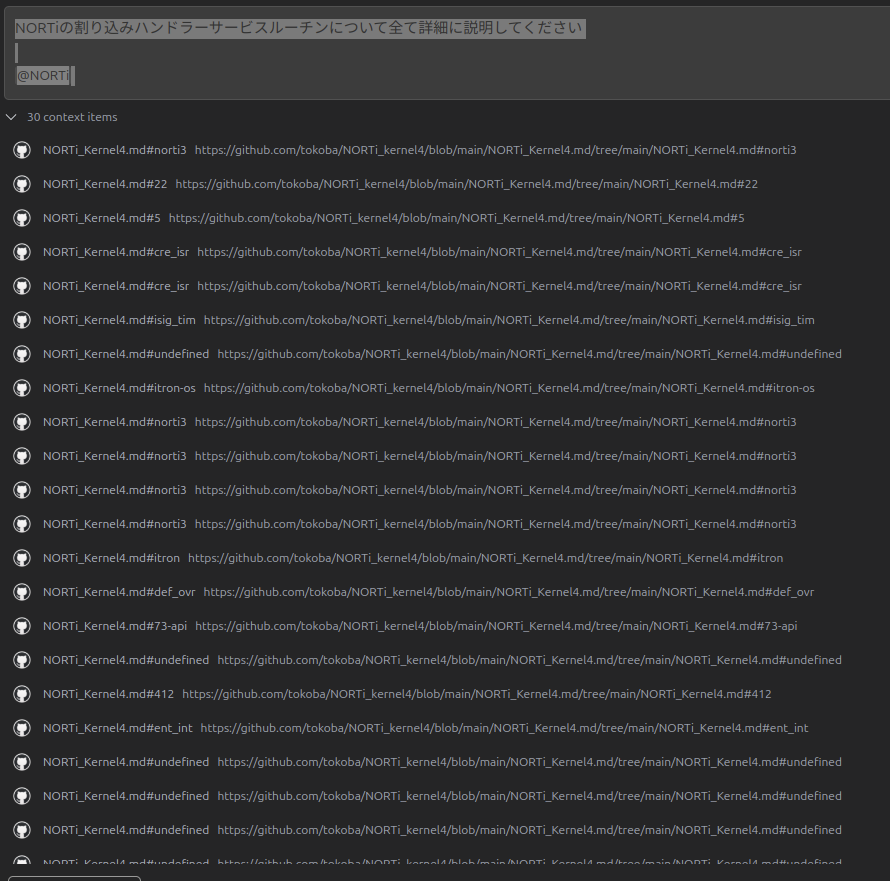

# RAG

## まとめ

- 人はLLMのための従順な奴隷として文書を丁寧に整形して渡すことに専念すべき
- 人はあらゆる文書はマークダウン記法で記述すべき
- パワポの図とかは以ての外で, マーメイド記法に統一すべき

---

# 開発環境


## 埋め込みベクター処理用のモデル

Snowflake Arctic Embed 2

パラメーター数 : 568m

説明: VRAM 1GB程度で動かせる軽量なもの
Arctic Embed 2.0は、これまでのリリースで培った堅牢な基盤をベースに、英語のパフォーマンスや拡張性を損なうことなく多言語サポートを追加し、幅広い言語とアプリケーションにまたがる、より幅広いユーザーベースのニーズに対応します。


## 推論(inference)用のモデル

Alibaba Qwen3-32B-Q8_0.gguf

パラメーター数: 32B

説明: ローカルLLMとしては最高クラス。VRAM 30GB-40GB程度で動かせるもの。

## セットアップ

エディター: VSCode

拡張機能  : Continue

LLM runner : Ollama (Docker container)

LLM models : 上記の通り

---

# 作成した整形ドキュメント


# 質問1

```
NORTiの割り込みハンドラーサービスルーチンについて全て詳細に説明してください
@NORTi
```
# 回答



NORTiでは、割込み管理機能を担う2種類のコンセプトが存在します：「割込みハンドラ (Interrupt Handler)」と「割込みサービスルーチン (Interrupt Service Routine, ISR)」。これらはμITRON仕様に基づいており、カーネルの処理とユーザの独自処理の役割分担を担っています。

---

## 割込みハンドラ

### 概要
NORTiでは、**割込みハンドラは直接C言語で記述**することが可能で、スタック管理を除くレジスタの待避/復元を行う独自の`ent_int()`・`ret_int()`システムコールが提供されています。カーネルは割込みハンドラに直接介入せず、制御がユーザのコードに直接渡ります。

### 仕様と実装
- **割込みハンドラの定義と登録**  
  システムコール`def_inh()`を使用します。これはカーネルが割込みベクタを管理する方法として動作します。
  
  ```c
  def_inh(IRQ_NO, inthdr);
  ```
  ここでは、対応する割込み番号`IRQ_NO`に割込みハンドラ`inthdr`を設定しています。

- **割込みハンドラのテンプレート**  
  ```c
  INTHDR inthdr(void) {
      ent_int(); // スタックの切替えとレジスタ待避
      /* 割込み処理 */
      ret_int(); // レジスタ復元とタスク復帰
  }
  ```
  - `ent_int()`と`ret_int()`が必須です。これらはレジスタの保存と復元、スタック切り替えをNORTi内部で実施します。
  - `INTHDR`はNORTi独自の型であり、**割込みハンドラ関数としての属性を設定**します。

### 制限と制約
- **カーネルレベル以下の割込みレベル**でないと暴走の原因となる可能性があります。
- カーネルの割込み禁止レベル(`#define KNL_LEVEL 6`)よりも高い優先度の割込み処理は、カーネルの処理が上書きされるリスクがあるため避ける必要があります。

---

## 割込みサービスルーチン (ISR)

### 概要
割込みサービスルーチンは、μITRON4.0で導入されたより柔軟な割込み処理メカニズムです。これは、カーネル内に存在する割込みハンドラ（ent_int含む）によって呼ばれ、レジスタの保存/復元処理を内部で行います。そのため、ユーザはC言語の通常関数として利用できます。

### 仕様と実装
- **割込みサービスルーチンの定義**  
  システムコール`cre_isr()`を使用します。
  ```c
  cre_isr(IRQ_NO, isr_routine, exinf, istatr);
  ```
  - `istatr`には、例として`TA_HLNG`（高級言語）を指定します。
  - `exinf`は割込みサービスルーチンを呼び出す際に使用する引数です。

- **割込みサービスルーチンの実行**  
  割込みサービスルーチンは、`cre_isr()`で登録されると、後で割込みが発生した際、カーネル内のハンドラによって自動的に実行されます。

  例:
  ```c
  void isr_routine(INT inf) {
      // 割込み処理（タイマーや外部割込みの応答など）
      // auto変数が使えるため、一般的なC関数として扱える。
  }
  ```

### 特徴と制約
- **レジスタ待避/復元処理はNORTi内部で完了**されるため、C言語の通常関数で実装可能。
- **タスクとの同期や通信を行うことはできない**。これは、割込みコンテキストで実行されるため、スレッド安全でないAPI（タスク起動、イベント通知など）は利用できません。
- **カーネルレベルより高い優先度の割込みでは、サービスルーチンの利用は不可能**です。

---

## 比較表: 割込みハンドラ vs 割込みサービスルーチン

| 項目                     | 割込みハンドラ                      | 割込みサービスルーチン                |
|------------------------|-------------------------------------|-------------------------------------|
| 実装言語               | C言語、`INTHDR`型を指定              | 普通のC関数（auto変数が使用可能）     |
| システムコール         | `def_inh()`                        | `cre_isr()`                        |
| レジスタ管理           | ユーザが`ent_int()`・`ret_int()`を使用 | NORTiが自動でレジスタ管理           |
| スタック管理           | NORTiが専用スタックを使用               | タスクスタックを使用（通常）           |
| タスク同期可否         | 不可能                              | 不可能（割込みコンテキストなので）     |
| 割込みレベル           | カーネル以下が必要                   | 同様（カーネルレベル以下）            |

---

## システムコールと関連処理

### ent_int / ret_int
```c
INTHDR inthdr(void) {
    ent_int(); // → スタック切り替えとレジスタの一部保存
    isig_tim(); // （例）割込みをOSに通知
    ret_int(); // → レジスタ復元、タスク復帰
}
```

- `ent_int()`は、**スタックポインタを割込み専用スタックへ移動**し、レジスタの保存を行う。
- `ret_int()`は、**割込みからの復帰を処理**し、適切なタスクまたは次の割込みハンドラへ制御を戻す。

### カーネルの割込み禁止レベル
カーネル内の処理には一時的な割込み禁止が必要であるため、割込みサービスルーチンとハンドラが動作可能な割込みレベルは、カーネルによって制御されています。

---

## 注意点と推奨
- **複数の割込みハンドラ/サービスルーチンが同じ割込み番号を定義することはできない。**
- ハードウェアやプロセッサ依存の処理（割込みベクタの設定、ステータスレジスタの直接操作）については、`n4ixxx.c`に記述された関数を利用または独自に実装する必要があります。
- 高速かつ短い割込み処理が求められます。特に**割込みハンドラ内でCPUを長く占有するのは避けるべきです。**

---

## おわりに
NORTiの割込み管理は、μITRON4.0の仕様を基盤に、柔軟性のある2層構造（ハンドラとサービスルーチン）によって構成されています。割込みハンドラはレジスタ管理を自分で行いますが、サービスルーチンはNORTiがそれを完全に自動化しているため、C言語での通常関数として扱うことができます。両者に合わせて使い分けることで、リアルタイムな割込み処理を効率よく構築できます。


# 質問2


